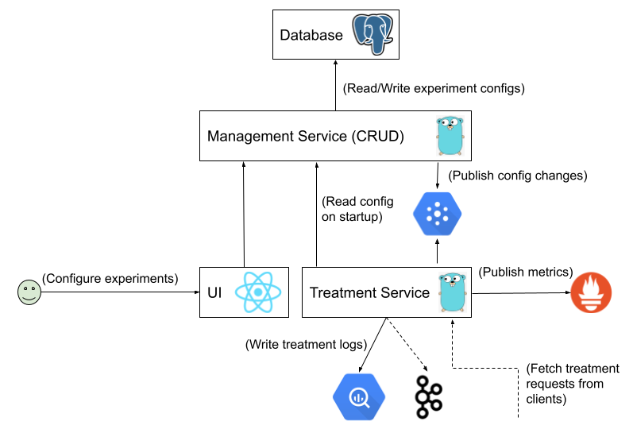

# Experiments Architecture

The overall view of the system architecture of CaraML Experiment engine can be illustrated in the diagram below:

You may refer to more details in the [repository](https://github.com/caraml-dev/xp) over here.
