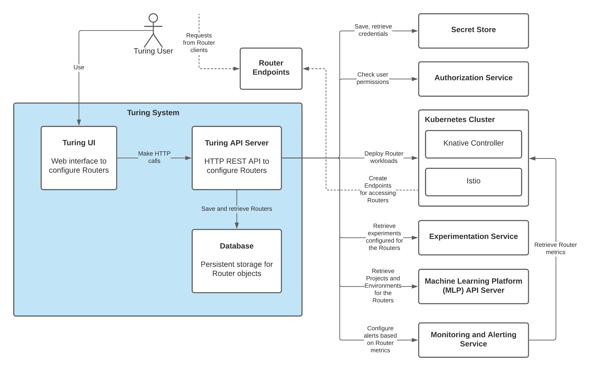

# Routers Architecture

The overall view of the system architecture of CaraML Traffic Routers can be illustrated in the diagram below:

You may refer to more details in the [repository](https://github.com/caraml-dev/turing) over here.
