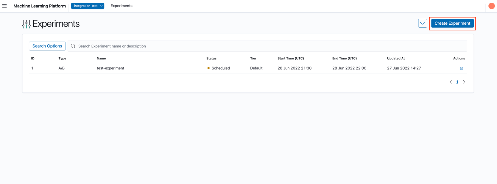
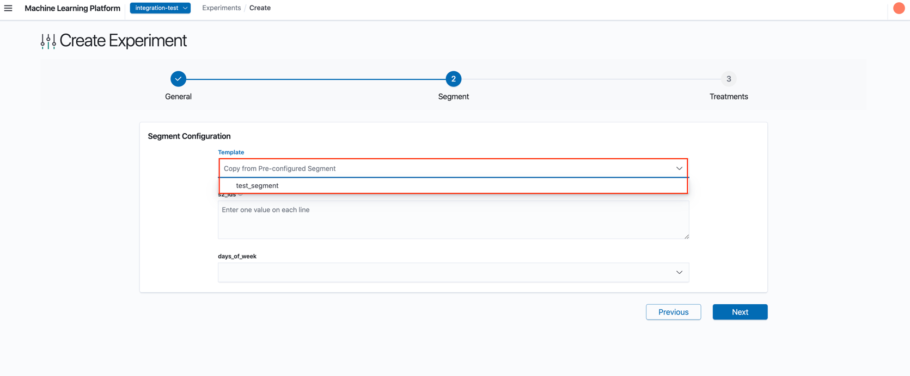
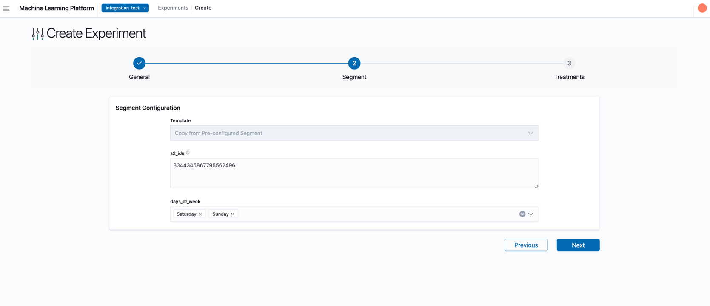
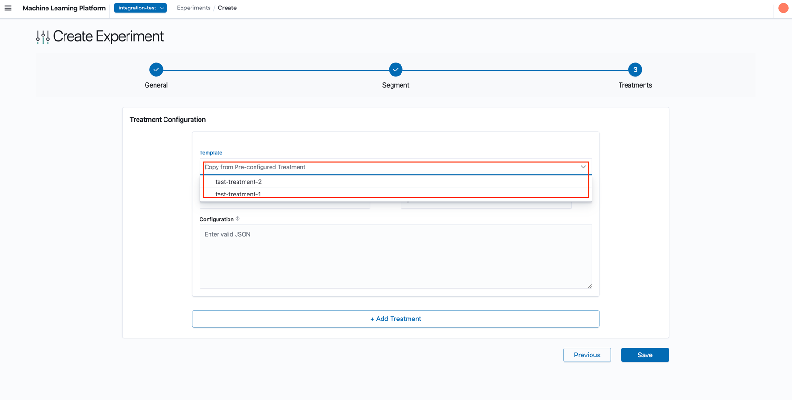

# Creating Experiments

## Type of experiments

### A/B Experiments

A/B experiments require the traffic allocation to be specified for each treatment, and the sum of the traffic for all treatments should be 100.

### Switchback Experiments

Switchback experiments, in the simplest form, are cyclical and require that the treatments do not carry any traffic specification. At every new time interval, the treatment that is chosen is the next in the list of treatments and the same treatment will be applied to all incoming requests.

## Experiment Creation

Experiments can be created from the experiments landing page.

## 0. Create Experiment

Click on the "Create Experiment" button on the landing page.

## 1. Configure Experiment's General Settings

a. In the Create Experiment's general settings page, fill up the form. The Switchback Configuration section will be shown for Switchback experiments.

1. __Name__: Name of experiment.
2. __Experiment__ Type: A/B or Switchback.
3. __Description__: Description of experiment.
4. __Status__: Active or inactive experiment. Experiment status can be toggled later.
5. __Tier__: Default or override experiment. The tier makes it possible to schedule 2 experiments on the same segment (one in each tier) where the value of the tier serves as the tie-breaker (the override experiment is given preference). This is useful to schedule short spikes to temporarily override a long-running experiment.
6. __Duration__: Start and end time of experiment. For all experiments, start time must be in the future.
7. __Switchback Interval__: Duration for which each treatment is alternately applied in successive time intervals.

b. Click the "Next" button.

## 2. Configure Experiment's Segmenters

a. In the Create Experiment's segmenter page, fill up the segmenters configuration. The segmenters shown will be based on the project settings. Segmenters marked with an asterisk(*) are required and cannot be left unset. All other segmenters are optional and where a value is not supplied, it results in a "weak" match and where it is supplied, there may be an "exact" match or a no match. For more information on optional segmenters and the matching behavior, please refer to the [Experiment Hierarchy](../concepts.md#Experiment-Hierarchy) section in the Introduction page.

You may choose to select a Pre-configured Segment from the drop down as highlighted in red below and edit them in-place for use.

Upon selection, the chosen Segment template values will be loaded into the respective segmenter fields configured for the project.

1. __s2_ids__: S2 ids of experiment, delimited by newline. The values can be set at levels 10-14.
2. __days_of_the_week__: Days of the week to run the experiment.
3. __hours_of_the_week__: Hours of the week to run the experiment.

b. Click the "Next" button.

## 3. Configure Experiment's Treatments

a. Fill in the treatment(s) configurations.
While selecting treatment(s) for the Experiment, you may create custom configuration or select a template. If a template is selected, the treatment fields will be auto-populated, further edit is possible (See `Creating Treatments` section to understand more about Treatments template).

Likewise to an Experiment's Segment, when configuring treatments for the Experiment, you may choose to select a Pre-configured Treatment from the dropdown as highlighted in red below and edit them in-place for use.

Upon selection, the chosen Treatment template values will be loaded into the respective treatment-related fields.

1. __Treatment Name__: Name of treatment (Input).
2. __Traffic Percentage__: Traffic allocation for treatment. Sum of traffic for all treatments should be 100. Traffic configuration is optional for switchback experiments.
3. __Configuration__: Treatment configuration JSON.

b. Click "Save" to create the experiment.
