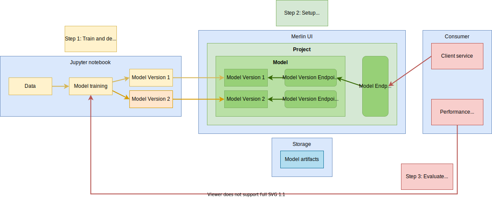

# Merlin

## Context

After you have built a model with high-quality training data and the perfect algorithm, it’s time to apply it to make predictions and serve the outcome for future decision making.
For many data scientists, model training can be done easily within their Jupyter notebook. However, things become trickier when it comes to productionizing the model to serve real traffic, which is engineering intensive. There are many tools available, but learning when and how to use them requires a lot of exploration, which can be a headache.

## User Flow

1. **Deploy a model**

    We want to make the deployment experience as seamless as possible, directly from Jupyter notebook. With the Merlin SDK, we can now upload the model and trigger the deployment pipeline, by simply calling a few functions in the notebook. Alternatively, Merlin UI supports the same, with just 1 click.

2. **Setup serving endpoint**

    Once the model is deployed with an auto-generated HTTP endpoint, you can then specify the serving model version in the console. Give it a minute and your model will automagically be able to serve prediction.

3. **Evaluate and iterate**

    The Merlin UI allows you to deploy and track different model versions and tag any version to run experiment easily. All model artifacts are synchronized into MLflow Tracking, which can be used to track and compare the model performance.

## Concepts

**Project**: Project represents a namespace for a collection of model. For example, a project could be food Recommendations, driver allocation, ride pricing, etc.

**Model**: Every model is associated with one (and only one) project and model endpoint. Model also can have zero or more model versions. In the entities' hierarchy of MLflow, a model corresponds to an MLflow experiment.

**Model Endpoint**: Every model has each own endpoint that contains routing rule to active model version endpoint.

**Model Version**: The model version represents an iteration within a model. A model version is associated with a run within MLflow. A Model Version can be deployed as a service, there can be multiple deployments of model version with different endpoint each.

**Model Version Endpoint**: A model version endpoint is a way to obtain model inference results in real-time, over the network (HTTP).

**Environment**: The environment’s name is a user-facing property that will be used to determine the target Kubernetes cluster where a model will be deployed to. The environment has two important properties, name and Kubernetes cluster.
