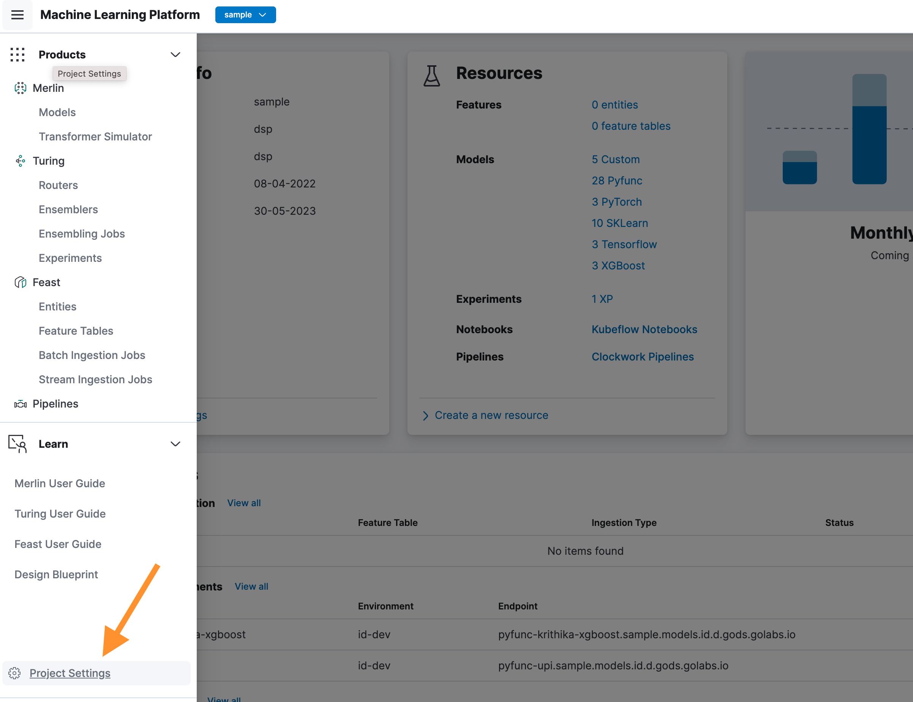
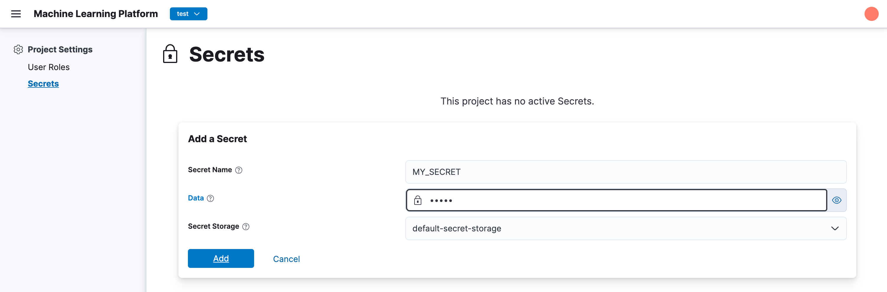

# CaraML Secret

CaraML provides capability for storing user's secret in the platform. The secret can be used by the user within CaraML workfload such as batch prediction, router deployment, and pipeline.
The secret is stored within a secret storage which can be configured in CaraML deployment.

## Creating Secret

To create a secret, user can visit the project settings page and click the "Secret" tab.



The secret tab will show the list of secret that has been created for the project. User can click the "Create Secret" button to create a new secret.



## Configuring Default Secret Storage

By default, a CaraML installation will use internal secret storage. The internal secret storage is a simple key-value store that is stored in the database.
For a more secure secret storage, CaraML can be configured to use external secret storage such as Hashicorp Vault.
To configure the default secret storage, user can specify `defaultSecretStorage` configuration when deploying the [MLP component](https://github.com/caraml-dev/helm-charts/tree/main/charts/mlp).
Currently, the supported secret storage is `internal` and `vault`.

For example following configuration will configure CaraML to use Hashicorp Vault as the default secret storage.

```yaml
  defaultSecretStorage:
    name: vault
    type: vault
    config:
      vaultConfig:
        url: https://localhost:8200
        role: my-role
        mountPath: secret
        pathPrefix: caraml-secret/{{ .Project }}/
        authMethod: gcp
        gcpAuthType: gce
```

Below table shows the list of supported configuration when using vault secret storage.

### Vault Configurations

| name  | description  | required  | example  |
|----|---|---|---|
|  url |  vault URL | y  | https://localhost:8200  |
| role  |  role name to be used when authenticating against Vault | y (not required when `authMethod` is set to `token`)  | my-role  |
|  mountPath | [vault mount path](https://developer.hashicorp.com/vault/tutorials/enterprise/namespace-structure)  |  y |  secret |
|  pathPrefix | path prefix of the secret in Vault. Path prefix must contains placeholder for project {{ .Project }}  |  y |   caraml-secret/{{ .Project }}/ |
|  authMethod | authentication method  |  y |  `gcp`, `token` (Do not use `token` for production use-case) |
|  gcpAuthType | GCP authentication type  |  required when `authMethod` is set to `gcp` |  `gce`, `iam` |
|  serviceAccountEmail | Service account email to be used when using `iam` gcp auth  |  required when `authMethod` is set to `gcp` and `gcpAuthType` is `iam` |  service-account@example.com |
|  token | Vault token to be used for authentication when `authMethod` is set to `token`  |  required when `authMethod` is set to `token`|  test-token |
