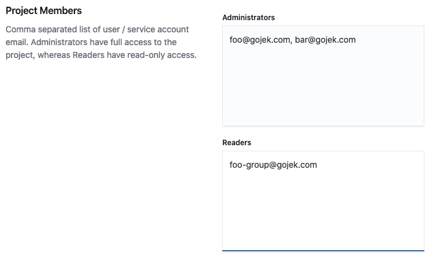

# Create a project

### Choose “Create Project” in the projects dropdown.

.png>)

### Name your project.

.png>)

### Select a team.

.png>)

### Select a stream.

.png>)

### Define a list of project members that can access your project.

These members can either be individual users or service accounts, defined by their emails and can be granted Administrator or Reader privileges. There are 2 required inputs.

* **Administrators**: These users will have full access to your project.
* **Readers**: These users will have read-only access to your project.

You can optionally add labels, which are key-value pairs, to your project. These labels will be applied to the Kubernetes resources of your project.

.png>)

### Submit your project.

Click “Submit” to create your project. If your project is successfully created, you will be taken to the Project Settings page of your newly created project.
